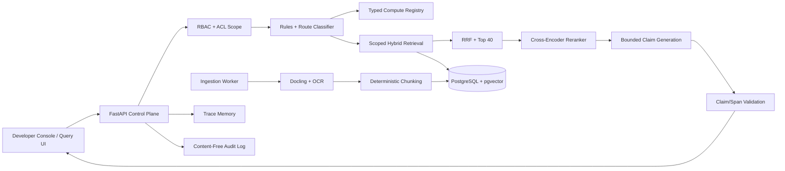

# Cortex Architecture

## Deployment Boundary
The browser application is the canonical UI. A future Electron wrapper may load the same compiled assets and API contracts, but it must not become the only distribution path.

## Security Boundary
Every retrieval call requires an `AccessScope`. Enterprise and ACL principals are applied in both lexical and vector SQL before results leave PostgreSQL. A final authorization assertion guards returned rows as defense in depth.
